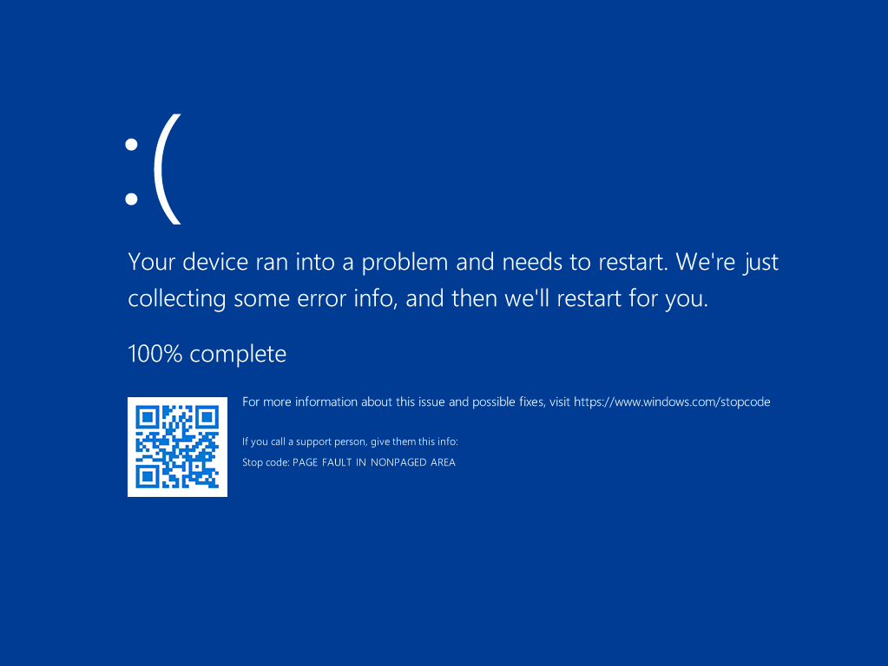

# **win32kbase!NtUserRegisterLogonProcess Untrusted Pointer Dereference**

## **Description**
The second parameter of the function `win32kbase!NtUserRegisterLogonProcess` can point to a kernel-mode address, potentially causing a system crash due to an untrusted pointer dereference.

The "attack" vector is through the `winlogon` process. 

[MSRC](https://msrc.microsoft.com/) decided not to remediate the vulnerability, citing the requirement for high privileges to execute code within the `winlogon` process. As of the latest version of `Windows 11 24H2` (`OS Build 26100.4349`), the vulnerability remains unpatched.

The easiest way to reproduce the bug is through a kernel debugger.

## **Trigger - "PoC"**
Attach a kernel debugger at boot and set a breakpoint on `win32u!NtUserRegisterLogonProcess`.

Once the breakpoint is hit, modify the value of the `RDX` register:

```
0: kd> r rdx=FFFFF78000001000
```

Then, allow the system to continue by running the "g" (go) command. The system will crash:



### **Callstack**

```
0: kd> k
 # Child-SP          RetAddr               Call Site
00 0000003d`78a7f5b8 00007ffd`616e14bb     win32u!NtUserRegisterLogonProcess
01 0000003d`78a7f5c0 00007ff6`0c14159e     USER32!RegisterLogonProcess+0xb
02 0000003d`78a7f5f0 00007ff6`0c188a05     winlogon!CreatePrimaryTerminal+0x5e
03 0000003d`78a7f680 00007ff6`0c18d0e9     winlogon!CSession::CreatePrimaryTerminal+0x2e9
04 0000003d`78a7f750 00007ff6`0c194725     winlogon!WinMain+0xb59
05 0000003d`78a7fd80 00007ffd`6064e8d7     winlogon!__mainCRTStartup+0x1ad
06 0000003d`78a7fe40 00007ffd`6237c34c     KERNEL32!BaseThreadInitThunk+0x17
07 0000003d`78a7fe70 00000000`00000000     ntdll!RtlUserThreadStart+0x2c
0: kd> r
rax=00007ffd616e14b0 rbx=000001e3b65047b0 rcx=00000000000002fc
rdx=000001e3b650464c rsi=000001e3b65047d0 rdi=000001e3b65047b8
rip=00007ffd600bb230 rsp=0000003d78a7f5b8 rbp=0000000000000000
 r8=000001e3b65047d0  r9=000001e3b65047c8 r10=0000000000000000
r11=0000003d78a7f510 r12=0000000000000000 r13=0000000000000001
r14=000001e3b65047c8 r15=0000000000000000
iopl=0         nv up ei pl nz na po nc
cs=0033  ss=002b  ds=002b  es=002b  fs=0053  gs=002b             efl=00000206
win32u!NtUserRegisterLogonProcess:
0033:00007ffd`600bb230 4c8bd1          mov     r10,rcx
0: kd> r rdx=FFFFF78000001000
0: kd> g
KDTARGET: Refreshing KD connection

*** Fatal System Error: 0x00000050
                       (0xFFFFF78000001000,0x0000000000000000,0xFFFFF80528F293CB,0x0000000000000002)

Break instruction exception - code 80000003 (first chance)

A fatal system error has occurred.
Debugger entered on first try; Bugcheck callbacks have not been invoked.

A fatal system error has occurred.

For analysis of this file, run !analyze -v
nt!DbgBreakPointWithStatus:
fffff805`93d01880 cc              int     3
1: kd> !analyze -v
Connected to Windows 10 26100 x64 target at (Wed Jun 11 11:05:56.399 2025 (UTC + 8:00)), ptr64 TRUE
Loading Kernel Symbols
...............................................................
................................................................
.............
Loading User Symbols
.....................
Loading unloaded module list
........
*******************************************************************************
*                                                                             *
*                        Bugcheck Analysis                                    *
*                                                                             *
*******************************************************************************

PAGE_FAULT_IN_NONPAGED_AREA (50)
Invalid system memory was referenced.  This cannot be protected by try-except.
Typically the address is just plain bad or it is pointing at freed memory.
Arguments:
Arg1: fffff78000001000, memory referenced.
Arg2: 0000000000000000, X64: bit 0 set if the fault was due to a not-present PTE.
	bit 1 is set if the fault was due to a write, clear if a read.
	bit 3 is set if the processor decided the fault was due to a corrupted PTE.
	bit 4 is set if the fault was due to attempted execute of a no-execute PTE.
	- ARM64: bit 1 is set if the fault was due to a write, clear if a read.
	bit 3 is set if the fault was due to attempted execute of a no-execute PTE.
Arg3: fffff80528f293cb, If non-zero, the instruction address which referenced the bad memory
	address.
Arg4: 0000000000000002, (reserved)

Debugging Details:
------------------


KEY_VALUES_STRING: 1

    Key  : AV.Type
    Value: Read

    Key  : Analysis.CPU.mSec
    Value: 19062

    Key  : Analysis.Elapsed.mSec
    Value: 30116

    Key  : Analysis.IO.Other.Mb
    Value: 67

    Key  : Analysis.IO.Read.Mb
    Value: 164

    Key  : Analysis.IO.Write.Mb
    Value: 313

    Key  : Analysis.Init.CPU.mSec
    Value: 27328

    Key  : Analysis.Init.Elapsed.mSec
    Value: 1060683

    Key  : Analysis.Memory.CommitPeak.Mb
    Value: 523

    Key  : Analysis.Version.DbgEng
    Value: 10.0.27829.1001

    Key  : Analysis.Version.Description
    Value: 10.2503.24.01 amd64fre

    Key  : Analysis.Version.Ext
    Value: 1.2503.24.1

    Key  : Bugcheck.Code.KiBugCheckData
    Value: 0x50

    Key  : Bugcheck.Code.LegacyAPI
    Value: 0x50

    Key  : Bugcheck.Code.TargetModel
    Value: 0x50

    Key  : Failure.Bucket
    Value: AV_R_(null)_win32kbase!WmsgpConnect

    Key  : Failure.Exception.IP.Address
    Value: 0xfffff80528f293cb

    Key  : Failure.Exception.IP.Module
    Value: win32kbase

    Key  : Failure.Exception.IP.Offset
    Value: 0x2c93cb

    Key  : Failure.Hash
    Value: {ece26be9-101a-e2cf-72a9-a92359219248}

    Key  : Hypervisor.Enlightenments.ValueHex
    Value: 0x6010fbe4

    Key  : Hypervisor.Flags.AnyHypervisorPresent
    Value: 1

    Key  : Hypervisor.Flags.ApicEnlightened
    Value: 0

    Key  : Hypervisor.Flags.ApicVirtualizationAvailable
    Value: 0

    Key  : Hypervisor.Flags.AsyncMemoryHint
    Value: 0

    Key  : Hypervisor.Flags.CoreSchedulerRequested
    Value: 0

    Key  : Hypervisor.Flags.CpuManager
    Value: 0

    Key  : Hypervisor.Flags.DeprecateAutoEoi
    Value: 1

    Key  : Hypervisor.Flags.DynamicCpuDisabled
    Value: 1

    Key  : Hypervisor.Flags.Epf
    Value: 0

    Key  : Hypervisor.Flags.ExtendedProcessorMasks
    Value: 1

    Key  : Hypervisor.Flags.HardwareMbecAvailable
    Value: 1

    Key  : Hypervisor.Flags.MaxBankNumber
    Value: 0

    Key  : Hypervisor.Flags.MemoryZeroingControl
    Value: 0

    Key  : Hypervisor.Flags.NoExtendedRangeFlush
    Value: 0

    Key  : Hypervisor.Flags.NoNonArchCoreSharing
    Value: 0

    Key  : Hypervisor.Flags.Phase0InitDone
    Value: 1

    Key  : Hypervisor.Flags.PowerSchedulerQos
    Value: 0

    Key  : Hypervisor.Flags.RootScheduler
    Value: 0

    Key  : Hypervisor.Flags.SynicAvailable
    Value: 1

    Key  : Hypervisor.Flags.UseQpcBias
    Value: 0

    Key  : Hypervisor.Flags.Value
    Value: 659708

    Key  : Hypervisor.Flags.ValueHex
    Value: 0xa10fc

    Key  : Hypervisor.Flags.VpAssistPage
    Value: 1

    Key  : Hypervisor.Flags.VsmAvailable
    Value: 1

    Key  : Hypervisor.RootFlags.AccessStats
    Value: 0

    Key  : Hypervisor.RootFlags.CrashdumpEnlightened
    Value: 0

    Key  : Hypervisor.RootFlags.CreateVirtualProcessor
    Value: 0

    Key  : Hypervisor.RootFlags.DisableHyperthreading
    Value: 0

    Key  : Hypervisor.RootFlags.HostTimelineSync
    Value: 0

    Key  : Hypervisor.RootFlags.HypervisorDebuggingEnabled
    Value: 0

    Key  : Hypervisor.RootFlags.IsHyperV
    Value: 0

    Key  : Hypervisor.RootFlags.LivedumpEnlightened
    Value: 0

    Key  : Hypervisor.RootFlags.MapDeviceInterrupt
    Value: 0

    Key  : Hypervisor.RootFlags.MceEnlightened
    Value: 0

    Key  : Hypervisor.RootFlags.Nested
    Value: 0

    Key  : Hypervisor.RootFlags.StartLogicalProcessor
    Value: 0

    Key  : Hypervisor.RootFlags.Value
    Value: 0

    Key  : Hypervisor.RootFlags.ValueHex
    Value: 0x0

    Key  : SecureKernel.HalpHvciEnabled
    Value: 0

    Key  : WER.OS.Branch
    Value: ge_release

    Key  : WER.OS.Version
    Value: 10.0.26100.1


BUGCHECK_CODE:  50

BUGCHECK_P1: fffff78000001000

BUGCHECK_P2: 0

BUGCHECK_P3: fffff80528f293cb

BUGCHECK_P4: 2

FAULTING_THREAD:  ffff9901fcca3080

READ_ADDRESS:  fffff78000001000 

MM_INTERNAL_CODE:  2

PROCESS_NAME:  winlogon.exe

STACK_TEXT:  
ffff980a`f9c7eb58 fffff805`93db5c72     : ffff980a`f9c7ebd8 00000000`00000001 00000000`00000100 fffff805`93ebe101 : nt!DbgBreakPointWithStatus
ffff980a`f9c7eb60 fffff805`93db519c     : 00000000`00000003 ffff980a`f9c7ecc0 fffff805`93ebe270 00000000`00000050 : nt!KiBugCheckDebugBreak+0x12
ffff980a`f9c7ebc0 fffff805`93d00b77     : 00000000`00000000 fffff805`93b1d2bf ffff9901`f9991a98 ffff9901`f9991878 : nt!KeBugCheck2+0xb2c
ffff980a`f9c7f350 fffff805`93b1ded4     : 00000000`00000050 fffff780`00001000 00000000`00000000 ffff980a`f9c7f5f0 : nt!KeBugCheckEx+0x107
ffff980a`f9c7f390 fffff805`93a7dff0     : 00000000`00000000 ffff8000`00000000 fffff780`00001000 0000007f`fffffff8 : nt!MiSystemFault+0x7a0
ffff980a`f9c7f480 fffff805`93eb37cb     : 00000000`00000000 00000000`00000000 ffff9901`fcc1adc0 ffff980a`f9c7f880 : nt!MmAccessFault+0x630
ffff980a`f9c7f5f0 fffff805`28f293cb     : ffff980a`f9c7f890 fffff805`28c7ff98 ffff980a`f9c7f890 ffff9901`fcc12e28 : nt!KiPageFault+0x38b
ffff980a`f9c7f780 fffff805`28dd4ca8     : 00000000`00000057 ffff9901`fcca2080 ffff9901`fb6f8d10 ffff9901`fcc0a000 : win32kbase!WmsgpConnect+0xe7
ffff980a`f9c7f9b0 fffff805`28db170f     : ffff9901`fcc0a000 ffff9901`fcc0a000 00000000`000002fc ffffd108`c6b4a8e0 : win32kbase!RegisterLogonProcess+0x258
ffff980a`f9c7fa40 fffff805`25a127bc     : fffff780`00001000 ffff980a`f9c7fb20 000001e3`b65047d0 000001e3`b65047b0 : win32kbase!NtUserRegisterLogonProcess+0x9f
ffff980a`f9c7fa70 fffff805`93eb7c55     : ffff9901`fcca3080 000001e3`b65047b0 ffff9901`fcca3080 000001e3`b65047d0 : win32k!NtUserRegisterLogonProcess+0x44
ffff980a`f9c7faa0 00007ffd`600bb244     : 00007ffd`616e14bb 00000000`00000000 00000000`00000000 00000000`00000000 : nt!KiSystemServiceCopyEnd+0x25
0000003d`78a7f5b8 00007ffd`616e14bb     : 00000000`00000000 00000000`00000000 00000000`00000000 00000000`00000000 : win32u!NtUserRegisterLogonProcess+0x14
0000003d`78a7f5c0 00007ff6`0c14159e     : 00000000`000002fc 000001e3`b650464c 000001e3`b65047d0 000001e3`b65047c8 : USER32!RegisterLogonProcess+0xb
0000003d`78a7f5f0 00007ff6`0c188a05     : 000001e3`b65047b0 00000000`00000000 000001e3`b65047d0 000001e3`b65047c8 : winlogon!CreatePrimaryTerminal+0x5e
0000003d`78a7f680 00007ff6`0c18d0e9     : 00000000`00000000 00000000`00000000 00000000`00000001 0000003d`78a7f7d4 : winlogon!CSession::CreatePrimaryTerminal+0x2e9
0000003d`78a7f750 00007ff6`0c194725     : 000001e3`b610635c 00000000`00000000 00000000`00000000 00000000`00000000 : winlogon!WinMain+0xb59
0000003d`78a7fd80 00007ffd`6064e8d7     : 00000000`00000000 00000000`00000000 00000000`00000000 00000000`00000000 : winlogon!__mainCRTStartup+0x1ad
0000003d`78a7fe40 00007ffd`6237c34c     : 00000000`00000000 00000000`00000000 00000000`00000001 0000003d`78aff000 : KERNEL32!BaseThreadInitThunk+0x17
0000003d`78a7fe70 00000000`00000000     : 00000000`00000000 00000000`00000000 00000000`00000000 00000000`00000000 : ntdll!RtlUserThreadStart+0x2c


SYMBOL_NAME:  win32kbase!WmsgpConnect+e7

MODULE_NAME: win32kbase

IMAGE_NAME:  win32kbase.sys

IMAGE_VERSION:  10.0.26100.4343

STACK_COMMAND: .process /r /p 0xffff9901fcca2080; .thread 0xffff9901fcca3080 ; kb

BUCKET_ID_FUNC_OFFSET:  e7

FAILURE_BUCKET_ID:  AV_R_(null)_win32kbase!WmsgpConnect

OS_VERSION:  10.0.26100.1

BUILDLAB_STR:  ge_release

OSPLATFORM_TYPE:  x64

OSNAME:  Windows 10

FAILURE_ID_HASH:  {ece26be9-101a-e2cf-72a9-a92359219248}

Followup:     MachineOwner
---------

1: kd> u win32kbase!WmsgpConnect+0xe7
win32kbase!WmsgpConnect+0xe7:
fffff805`28f293cb 8b01            mov     eax,dword ptr [rcx]
fffff805`28f293cd 89442420        mov     dword ptr [rsp+20h],eax
fffff805`28f293d1 448b4904        mov     r9d,dword ptr [rcx+4]
fffff805`28f293d5 4c8d0514f0f9ff  lea     r8,[win32kbase!`string' (fffff805`28ec83f0)]
fffff805`28f293dc ba91000000      mov     edx,91h
fffff805`28f293e1 488d8c24e0000000 lea     rcx,[rsp+0E0h]
fffff805`28f293e9 e8e608e9ff      call    win32kbase!StringCchPrintfW (fffff805`28db9cd4)
fffff805`28f293ee 488d8424e0000000 lea     rax,[rsp+0E0h]
```
